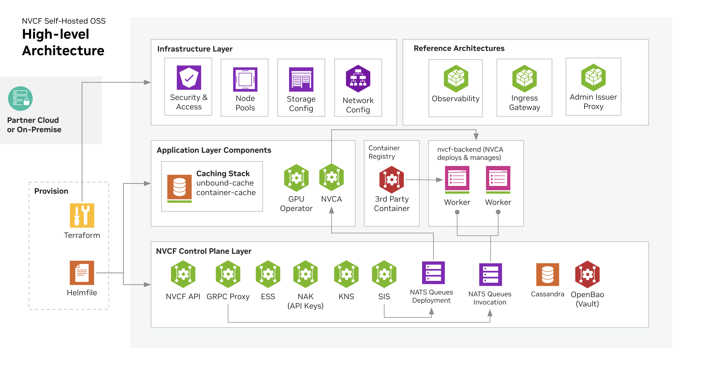

# NVIDIA Cloud Functions (NVCF)

NVIDIA Cloud Functions (NVCF) is a platform for deploying, managing, and running GPU-accelerated functions at scale. It routes inference, streaming, and other GPU work to worker clusters, so you can scale demanding workloads with less infrastructure to run yourself.

Use this repository to:
- Report bugs and request features across any NVCF component
- Find links to component repositories
- Get oriented as a new contributor

See our [local development guide](https://docs.nvidia.com/cloud-functions/current/latest/local-development.html#local-development).

## Architecture

A self-hosted NVCF deployment includes the core components needed for inference. There are also optional components such as caching and low-latency streaming.

## Why use NVCF?

NVCF turns fragmented GPU resources into a single, scalable API for AI inference and media processing.

- Unified control plane: One place to manage and route requests across GPU clusters in multiple regions.
- Task distribution: Load-balances inference, streaming, and custom workloads based on worker availability.
- Protocols: REST, gRPC, and WebSockets, including low-latency streaming.
- Autoscaling: Scale from a single machine to large multi-node clusters without changing application code.
- Mixed hardware: Spread work across clusters with different GPUs to balance cost and performance.
- Observability: Health checks and telemetry for worker status and request latency.

## Repositories

| Repository | Description | Status |
|---|---|---|
| [nvcf-go](https://github.com/NVIDIA/nvcf-go) | NVCF Go client library | ✅ Live |
| [nvcf-byoo-otel-collector](https://github.com/NVIDIA/nvcf-byoo-otel-collector) | BYO Observability OpenTelemetry Collector | ✅ Live |
| [nvcf-otelconfig](https://github.com/NVIDIA/nvcf-otelconfig) | NVCF OpenTelemetry Configuration Library | ✅ Live |
| nvcf-icms-translate | Image/container manifest translation service | April 2026 |
| nvcf-image-credential-helper | Registry credential injection for container pulls | April 2026 |
| nvcf-nats-auth-callout-service | NATS authentication callout service | April 2026 |
| nvcf-container-cache | Container image caching layer | April 2026 |
| nvcf-dns-cache | DNS caching service | April 2026 |
| nvcf-nvca | NVIDIA cluster agent - handles workload scheduling and deployment, and GPU resource lifecycle | April 2026 |
| nvcf-invocation-service | Service that handles NVCF function invocations, routing requests to workers and managing response streaming via pull-based system using NATS | April 2026 |
| nvcf-function-autoscaler | Autoscaling service that monitors function invocation and usage patterns and horizontally scales NVCF function instance counts across clusters | April 2026 |
| nvcf-rate-limiter | Per-function rate-limiting service that throttles requests to a function | April 2026 |
| nvcf-grpc-proxy | Stateful function invocation service used for bi-directional communication and state management | April 2026 |
| nvcf-reval | Helm chart validation service that renders Helm charts with dynamic data | April 2026 |
| nvcf-worker | Worker sidecar containers (utils, init, task) that handle work pulling from NATS, response streaming, and lifecycle management on GPU-powered workers | Q2 2026 |
| nvcf-service | Core NVCF REST API service for managing and invoking cloud functions | Q2 2026 |
| nvcf-nvct-service | NVIDIA Cloud Tasks (NVCT) service — manages long-running, one-and-done GPU workloads such as fine-tuning and TensorRT engine builds | Q2 2026 |
| nvcf-self-hosted-charts | Consolidated Helm chart mono-repo for self-hosted NVCF deployments, combining previously split chart repositories | Q2 2026 |

## Reporting Issues

If you have found a bug or want to request a feature, please [open an issue](https://github.com/NVIDIA/nvidia-cloud-functions/issues/new/choose) in this repository. Use the appropriate template and include the component name in the title (e.g., `[nvcf-nvca] Pod fails to start on arm64`).

If you are unsure which component is responsible, open the issue here and the team will triage it.

## Contributing

See [CONTRIBUTING.md](CONTRIBUTING.md) for guidelines on how to contribute to NVCF projects.

## License

Each component repository carries its own license. See the individual repositories for details.
